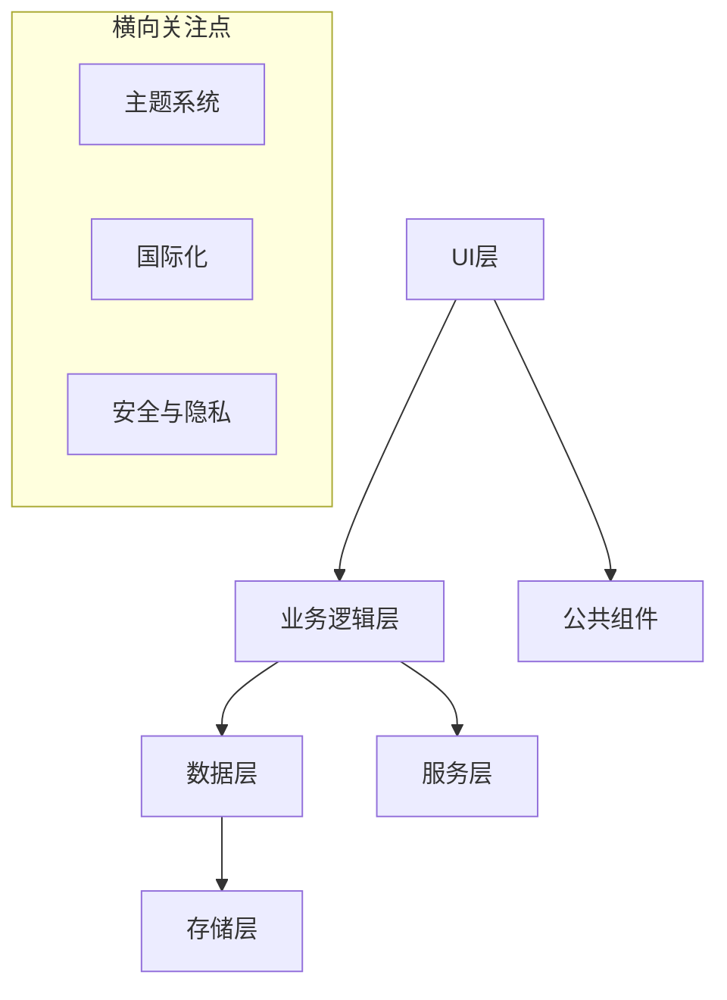
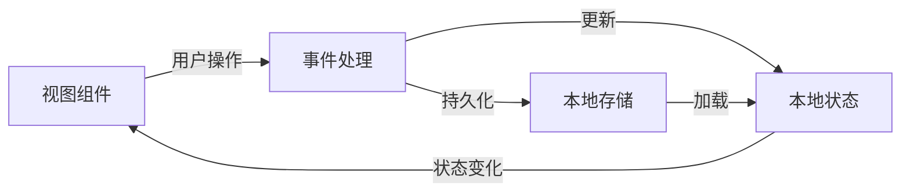
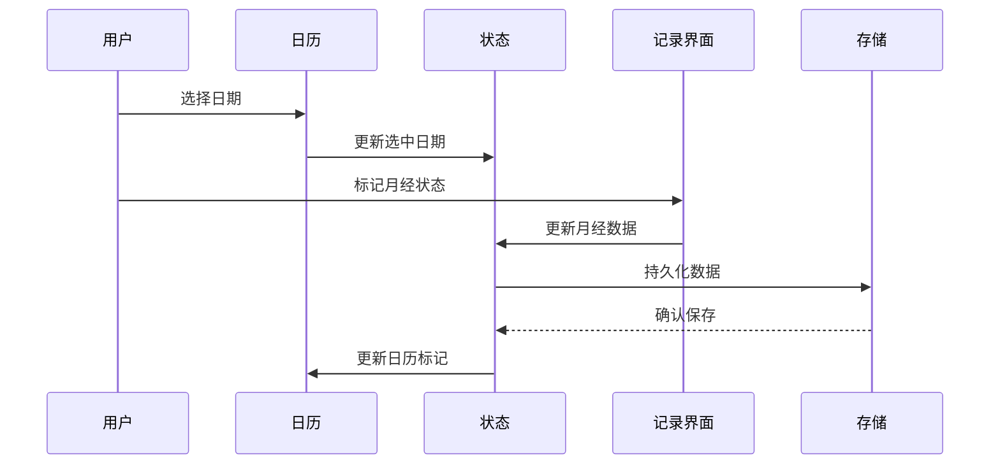
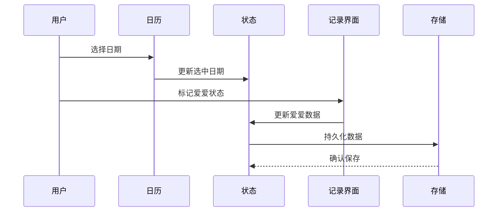

# 系统架构与设计模式：经期助手（PeriodAssistant）

## 整体架构

经期助手采用基于 uni-app 的跨平台架构设计，遵循以下架构原则：



### 主要架构层次

1. **UI层**
   - 页面组件（页面级别的视图）
   - 集成NutUI组件库（日历、图标、单选按钮等）
   - 遵循Vue 3组合式API设计模式

2. **业务逻辑层**
   - 经期记录业务逻辑
   - 爱爱记录业务逻辑
   - 日期处理逻辑（使用dayjs库）
   - 日历标记机制

3. **数据层**
   - 本地数据管理
   - 数据模型定义
   - 数据查询和过滤

4. **存储层**
   - 基于uni.setStorageSync的本地存储实现
   - 数据加载和持久化

## 核心设计模式

### 1. 数据模型设计

**当前已实现的数据模型**：
```typescript
// Interface for period data
export interface PeriodDay {
  date: number; // timestamp
  hasPeriod: boolean;
  hasLove?: boolean; // 爱爱记录字段
}
```

### 2. 组件设计模式

- **组合式API**：使用Vue 3的组合式API实现逻辑复用
- **第三方组件集成**：集成NutUI组件库实现UI界面
- **自定义样式覆盖**：通过样式覆盖定制NutUI组件外观

### 3. 状态管理

- 使用Vue响应式系统（ref, computed等）管理本地状态
- 状态与本地存储同步，保持数据持久化
- 使用组合式API组织业务逻辑

### 4. 数据流模式



### 5. 已实现的核心功能流程

**经期记录流程**：


**爱爱记录流程**：


## 已实现的代码组织结构

```
/src
  /pages                  # 应用页面
    /index                # 首页/日历和记录
  /utils                  # 工具函数
    /periodData.ts        # 经期数据处理模块
  /static                 # 静态资源
```

### 关键模块职责

1. **index/index.vue**
   - 集成日历组件
   - 提供经期记录和爱爱记录用户界面
   - 处理用户交互逻辑

2. **utils/periodData.ts**
   - 定义数据模型
   - 提供数据操作函数
   - 管理本地存储逻辑
   - 生成日历标记

## 技术选型与关键依赖

1. **核心框架**
   - Vue 3 + TypeScript
   - uni-app 跨平台框架

2. **UI组件库**
   - NutUI 组件库（日历、图标、单选按钮等）

3. **工具库**
   - dayjs（日期处理）

## 技术债务与演进计划

目前系统存在的技术债务：

1. **数据模型简化**
   - 当前数据模型较为简单，未来需扩展以支持更复杂的记录
   - 需添加更多字段支持详细症状和情绪记录

2. **UI组件复用性**
   - 当前UI组件耦合度较高，未来需要拆分为更小的可复用组件

3. **存储机制**
   - 简单使用本地存储，未来需考虑数据备份和同步机制

未来系统演进计划：

1. **当前阶段**：完善基础记录功能，优化界面体验
2. **阶段二**：添加预测算法与分析功能
3. **阶段三**：实现云同步与多设备支持
4. **阶段四**：添加高级功能（如健康建议、个性化预测）
5. **阶段五**：优化性能与用户体验，扩展平台支持

## 设计模式与架构决策

### 1. 组件化设计模式
- **实现方式**：将UI和功能分解为独立、可复用的组件
- **实际应用**：
  - `RecordSection.vue`：封装记录区域
  - `RecordItem.vue`：封装单个记录项
- **优势**：提高代码复用性，简化维护，便于扩展

### 2. 数据管理模式
- **实现方式**：集中定义数据结构和操作函数
- **实际应用**：
  - `periodData.ts`：定义`PeriodDay`接口和数据操作函数
  - 使用Vue的响应式API（ref）管理状态
- **优势**：统一数据访问入口，简化数据处理逻辑

### 3. 父子组件通信模式
- **实现方式**：通过props向下传递数据，通过自定义事件向上传递变更
- **实际应用**：
  - 父组件通过props传递日期、状态等数据
  - 子组件通过emit触发状态变更事件
- **优势**：明确的数据流向，降低组件间耦合

### 4. 生命周期管理模式
- **实现方式**：利用Vue生命周期钩子函数管理组件状态
- **实际应用**：
  - `onMounted`加载数据和初始化状态
  - 使用`computed`属性派生状态
- **优势**：确保组件初始化和资源加载的正确顺序

### 5. 本地存储模式
- **实现方式**：使用uni-app的存储API持久化数据
- **实际应用**：
  - `uni.setStorageSync`保存数据
  - `uni.getStorageSync`加载数据
  - 使用JSON序列化/反序列化数据
- **优势**：简单可靠的数据持久化方案，无需服务器支持

### 6. 事件处理模式
- **实现方式**：定义明确的事件处理函数响应用户交互
- **实际应用**：
  - `onSelect`处理日历选择
  - `onStatusChange`处理状态变更
- **优势**：清晰的事件处理流程，便于调试和维护

### 7. 样式封装模式
- **实现方式**：使用SCSS进行样式定义，模块化管理样式
- **实际应用**：
  - 公共样式抽取到`common.scss`
  - 组件中使用scoped样式
  - 使用深度选择器(:deep())修改第三方组件样式
- **优势**：样式模块化，避免样式冲突，提高可维护性

## 接口设计模式

### 1. 数据接口设计
```typescript
// 记录数据接口
interface PeriodDay {
  date: number;        // 时间戳
  hasPeriod: boolean;  // 经期状态
  hasLove?: boolean;   // 爱爱状态（可选）
}

// 记录项配置接口
interface RecordItemConfig {
  recordType: string;  // 记录类型
  label: string;       // 显示标签
  iconName: string;    // 图标名称
  noText: string;      // 否定选项文本
  yesText: string;     // 肯定选项文本
}
```

### 2. 组件Props接口设计
```typescript
// RecordSection组件Props
props: {
  date: {
    type: Number,
    required: true
  },
  periodStatus: {
    type: String,
    default: '0'
  },
  loveStatus: {
    type: String,
    default: '0'
  }
}

// RecordItem组件Props
props: {
  recordType: {
    type: String,
    required: true
  },
  label: {
    type: String,
    required: true
  },
  // 其他props...
}
```

### 3. 事件接口设计
```typescript
// RecordSection组件事件
emits: ['periodStatusChange', 'loveStatusChange']

// RecordItem组件事件
emits: ['statusChange']

// 状态变更事件数据结构
{
  type: string,  // 记录类型
  status: boolean // 状态值
}
```

## 发现的模式与最佳实践

### 1. 数据处理模式
- **日期转换标准化**：统一使用dayjs处理日期格式转换
- **数据操作封装**：封装数据CRUD操作，统一处理逻辑
- **错误处理**：使用try-catch处理数据加载错误

### 2. UI交互模式
- **状态可视化**：使用颜色和图标增强状态可视化
- **反馈机制**：状态变更立即反映在UI上
- **一致性设计**：相似功能采用一致的交互模式

### 3. 性能优化模式
- **按需计算**：使用computed属性减少不必要的计算
- **惰性加载**：在组件挂载时加载数据
- **状态本地化**：将全局状态同步到本地状态，减少重渲染

### 4. 可扩展性模式
- **组件参数化**：通过props配置组件行为
- **事件标准化**：统一的事件处理机制
- **数据结构可扩展**：接口设计预留扩展字段

## 需要解决的模式问题

### 1. 状态管理扩展
- **问题**：随着功能增加，简单的ref可能不足以管理复杂状态
- **可能方案**：引入Pinia进行全局状态管理

### 2. 数据层抽象
- **问题**：当前数据处理逻辑与存储机制耦合
- **可能方案**：引入数据访问层模式，抽象存储实现

### 3. UI组件系统化
- **问题**：随着UI组件增多，需要更系统的组件管理
- **可能方案**：构建组件库，统一风格和行为

### 4. 跨平台兼容性
- **问题**：不同平台可能存在样式和行为差异
- **可能方案**：增加平台适配层，处理平台特定逻辑

## 未来架构演进方向

### 短期演进
1. **提取更多可复用组件**：如日期选择器、状态切换组件等
2. **优化数据处理逻辑**：增加数据验证和规范化处理
3. **增强错误处理机制**：完善错误捕获和恢复策略

### 中期演进
1. **引入状态管理库**：考虑使用Pinia管理全局状态
2. **抽象数据层**：将数据访问与业务逻辑分离
3. **构建组件库**：形成统一的UI组件系统

### 长期演进
1. **考虑微服务架构**：将功能拆分为独立服务
2. **云同步支持**：添加云端数据同步能力
3. **插件系统**：支持功能扩展的插件架构 